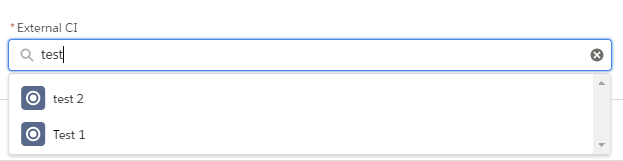

# Salesforce Lookup LWC
Custom lightning web component of a Lookup.

## Introduction
This component aims to provide a configurable lookup element to be used in a parent component.

## Table of contents

- [Installation](#installation)
- [Usage](#usage)
- [Examples](#examples)
- [Configurations](#configurations)
- [Tests](#tests)
- [Credits](#credits)
- [Contributing](#contributing)
- [License](#license)

## Installation
The content of this repository is available for installation as an Unlocked Package with [this link](https://login.salesforce.com/packaging/installPackage.apexp?p0=04t1t000003Y8gsAAC).

## Usage
This component is available for programmatic usage within a parent component.

## Examples

## Configurations

The component leverages the following configurations:

* `icon-name`
    - Description: Provide an icon for the lookup options.
    - Type: String
    - Required: false
    - Default: standard:choice

&nbsp;

* `mode`
    - Description: Specify what to display in the lookup dropdown, whether "findRecords" to retrieve options with a SOQL query or "getValues" to display them from a provided list of options.
    - Type: String
    - Required: false
    - Default: findRecords

&nbsp;

* `value-map`
    - Description: Provided list of possible dropdown options for the "getValues" mode.
    - Type: Array of objects
    - Required: false
    - Default: NA

&nbsp;

* `lookup-label`
    - Description: Label to display for the lookup element.
    - Type: String
    - Required: false
    - Default: NA

&nbsp;

* `tooltip-info`
    - Description: Help text to display for the lookup element.
    - Type: String
    - Required: false
    - Default: NA

&nbsp;

* `placeholder`
    - Description: Placeholder to display for the lookup element.
    - Type: String
    - Required: false
    - Default: NA

&nbsp;

* `required`
    - Description: Whether to show the lookup element as required.
    - Type: Boolean
    - Required: false
    - Default: false

&nbsp;

* `object-name`
    - Description: Object api name of the records to be searched.
    - Type: String
    - Required: false
    - Default: Account

&nbsp;

* `search-field`
    - Description: Field by which the records will be searched.
    - Type: String
    - Required: false
    - Default: Name

&nbsp;

* `extra-filter-type`
    - Description: Additional filter to apply to the SOQL query when searching the records.
    - Type: String
    - Required: false
    - Default: NA

&nbsp;

* `filter-formatting-parameters`
    - Description: List of dynamic parameters to apply to the extra filter clause.
    - Type: Array of objects
    - Required: false
    - Default: NA

## Tests
This projects leverages Apex Tests for the testing of Apex Classes. Jest Test for Lightning Web Components will be added soon.

## Credits

- **Mert Yalti** - Developer - [DevKein](https://github.com/DevKein)
- **Gabriel Serrano** - Developer - [jdkgabri](https://github.com/jdkgabri)

## Contributing
Contributions are what make the trailblazer community such an amazing place. I regard this component as a way to inspire and learn from others. Any contributions you make are greatly appreciated.

See [CONTRIBUTING.md](/CONTRIBUTING.md) for contribution principles.

## License
This project is licensed under the MIT License - see the [LICENSE.md](/LICENSE.md) file for details.
